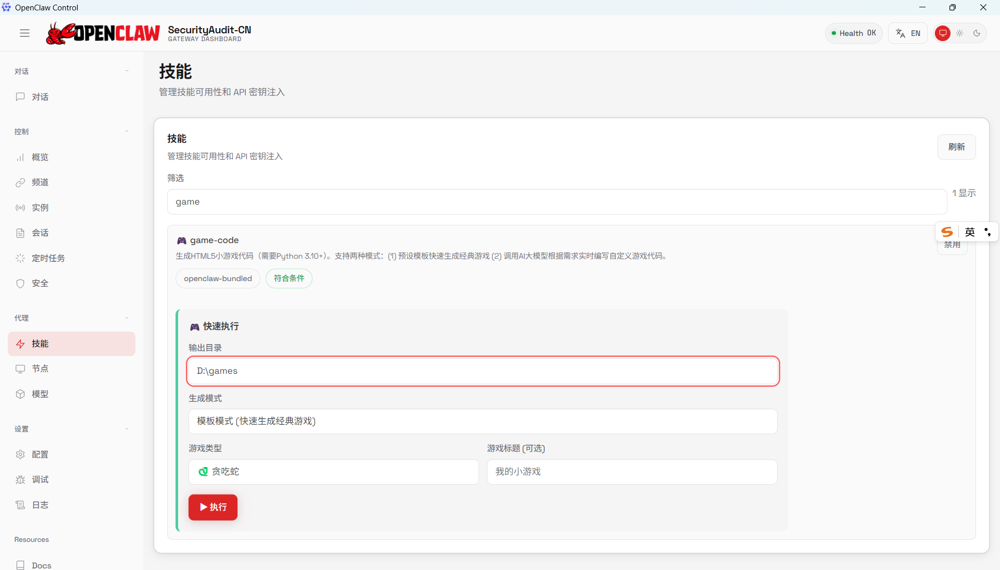
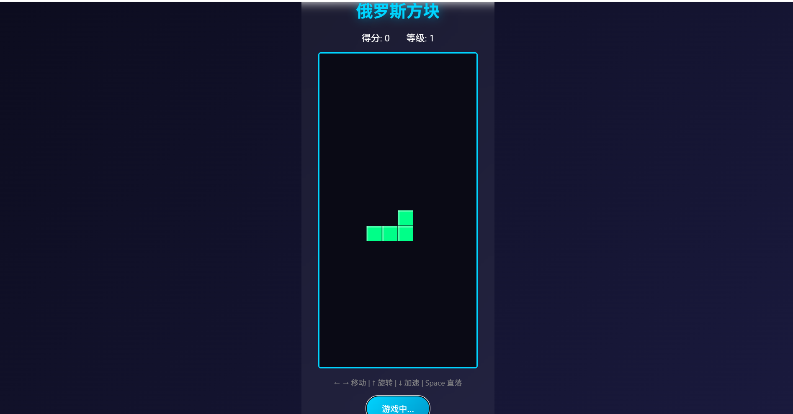

[English](README-EN.md) | [中文](README.md)

# TrustClaw 安全审计版

<p align="center">
  
</p>

<p align="center">
  <strong>AI 安全审计终端智能体</strong><br>
  一站式管理 AI 工具调用的安全检测、模型配置和技能扩展
</p>

---

## 🎁 免费接口 & Token 福利

> **好消息！** 我们为社区贡献者提供 **免费的安全审计接口 Token**，助力你的 AI 安全开发之旅！

### ✅ 领取条件

- 给本项目点过 Star ⭐
- 提交过 Issue / Pull Request
- 或是项目的活跃使用者

### 📮 如何领取

前往 **[免费 Token 领取通道](https://github.com/IrvinZheng/trustclaw_security/issues/1)**，按格式留下你的信息，我们会在 0-3 个工作日内审核并通过邮件发送 Token。

<p align="center">
  <a href="https://github.com/IrvinZheng/openclaw_security/issues/1">
    
  </a>
</p>

---

## 📦 下载安装

### Windows 用户

1. **下载安装包**
   
   从 [Releases](../../releases) 页面下载最新版本：
   ```
   TrustClaw-SecurityAudit-Setup-2026.x.xx.exe
   ```

2. **运行安装程序**
   
   - 双击 `.exe` 文件启动安装向导
   - 选择安装目录（默认即可）
   - 点击「安装」等待完成
   - 勾选「运行 TrustClaw SecurityAudit」后点击「完成」

3. **首次启动**
   
   安装完成后，应用会自动启动并：
   - 显示 Loading 界面
   - 后台启动 Gateway 服务
   - 加载控制台界面

### macOS 用户

1. **下载 DMG**
   ```
   TrustClaw-SecurityAudit-2026.x.xx-arm64.dmg  # Apple Silicon
   TrustClaw-SecurityAudit-2026.x.xx-x64.dmg    # Intel
   ```

2. **安装应用**
   - 双击打开 DMG 文件
   - 将应用拖拽到 Applications 文件夹
   - 首次打开时，右键选择「打开」以绕过 Gatekeeper

---

## 🛠️ 源代码启动（开发者）

如果你想从源代码运行或参与开发，请按以下步骤操作：

### 环境要求

| 依赖 | 版本要求 | 说明 |
|------|----------|------|
| Node.js | 22+ | JavaScript 运行时 |
| pnpm | 最新版 | 包管理器 |
| Python | 3.10+ | Skill 脚本运行（可选） |

### 步骤一：克隆仓库

```bash
git clone https://github.com/IrvinZheng/trustclaw_security.git
cd trustclaw_security
```

### 步骤二：安装依赖

```bash
# 安装项目依赖
pnpm install

# 进入桌面应用目录，安装 Electron 依赖
cd apps/desktop
npm install
```

### 步骤三：构建项目

```bash
# 回到项目根目录
cd ../..

# 构建主项目（TypeScript 编译）
pnpm build

# 构建 Control UI（Web 界面）
cd ui
pnpm build
cd ..
```

### 步骤四：启动应用

```bash
# 进入桌面应用目录
cd apps/desktop

# 启动 Electron 应用
npm start
```

### 开发模式

如果你在修改代码，可以使用开发模式：

```bash
# 终端 1：监听主项目变化（可选）
pnpm build --watch

# 终端 2：监听 UI 变化
cd ui
pnpm dev

# 终端 3：启动 Electron（开发模式）
cd apps/desktop
npm run dev
```

### 目录结构

```
trustclaw_security/
├── src/                    # 核心源代码
│   ├── cli/                # CLI 命令
│   ├── gateway/            # Gateway 服务
│   └── ...
├── ui/                     # Control UI (Web 界面)
│   ├── src/
│   └── ...
├── apps/
│   ├── desktop/            # Electron 桌面应用 ← 你在这里
│   │   ├── main.js         # Electron 主进程
│   │   ├── preload.js      # 预加载脚本
│   │   ├── renderer/       # 渲染进程（Loading 页面）
│   │   └── package.json    # Electron 配置
│   ├── android/            # Android 应用
│   ├── ios/                # iOS 应用
│   └── macos/              # 原生 macOS 应用
├── skills/                 # 技能/工具脚本
│   ├── game-code/          # 游戏代码生成器
│   └── ...
├── dist/                   # 构建输出
│   ├── control-ui/         # UI 构建产物
│   └── ...
└── package.json            # 项目配置
```

### 打包安装程序

构建完成后，可以打包为安装程序：

```bash
cd apps/desktop

# Windows 安装包
npm run build:win

# macOS 安装包（需在 macOS 上执行）
npm run build:mac

# 或使用一键脚本
# Windows:
.\build.bat

# macOS:
./build-mac.sh
```

打包输出位于 `apps/desktop/dist/` 目录。

### 常见问题

#### Q: `pnpm build` 报错 WSL/bash 不可用

在 Windows 上如果没有 WSL，可以跳过 canvas 打包步骤，直接运行：

```powershell
npx tsc -p tsconfig.json
```

#### Q: Electron 安装失败

设置国内镜像源：

```powershell
# Windows PowerShell
$env:ELECTRON_MIRROR="https://npmmirror.com/mirrors/electron/"
npm install
```

```bash
# macOS/Linux
export ELECTRON_MIRROR="https://npmmirror.com/mirrors/electron/"
npm install
```

#### Q: 启动后显示 "Gateway 启动失败"

确保已完成主项目构建：

```bash
cd /path/to/trustclaw_security
pnpm build
```

---

## ⚙️ 首次配置

### Token 自动生成

首次启动时，系统会自动生成 Gateway Token 并保存到配置文件：

```
~/.trustclaw/trustclaw.json  (用户配置)
```

配置文件示例：
```json
{
  "gateway": {
    "auth": {
      "token": "auto-generated-secure-token"
    }
  }
}
```

> 💡 **提示**：Token 用于保护 Gateway API，无需手动配置。

---

## 🎛️ 基本操作

### 1. 模型配置

进入 **配置 (Config)** 页面，设置 AI 模型：

| 配置项 | 说明 | 示例 |
|-------|------|------|
| `model.default` | 默认模型 | `gpt-4o`, `claude-3-5-sonnet` |
| `model.apiKey` | API 密钥 | `sk-xxx...` |
| `model.baseUrl` | 自定义接口地址（可选） | `https://api.openai.com/v1` |

**支持的模型提供商：**
- OpenAI (GPT-4, GPT-4o)
- Anthropic (Claude)
- DeepSeek
- 智谱 AI (GLM-4)
- 本地模型 (Ollama)

### 2. 安全配置

进入 **安全 (Security)** 页面，配置安全策略：

#### 安全网关设置

| 配置项 | 说明 |
|-------|------|
| 安全网关接口 | 第三方安全检测 API 地址 |
| API Token | 安全接口的认证令牌 |

#### Bot 安全开关

| 开关 | 功能 |
|------|------|
| 🛡️ 工具执行确认 | 中高风险操作需要用户确认 |
| 🌐 网络隔离模式 | 禁止访问外部网络 |
| 📁 文件系统限制 | 限制文件读写范围 |
| 📝 审计日志 | 记录所有工具调用 |
| ⏱️ 速率限制 | 防止 API 滥用 |

---

## 🎮 Skill 功能演示：Game Code

**Game Code** 是一个 HTML5 小游戏生成器，支持模板生成和 AI 智能生成两种模式。

### 从面板快速使用

1. 在左侧菜单找到 **代理 → 技能**
2. 在筛选框中搜索 `game`
3. 找到 **game-code** 技能卡片
4. 填写参数后点击 **执行** 按钮



**参数说明：**

| 参数 | 说明 | 示例 |
|------|------|------|
| 输出目录 | 游戏文件保存位置 | `D:\games` |
| 生成模式 | 模板模式或 AI 生成模式 | 模板模式 (快速生成经典游戏) |
| 游戏类型 | 选择游戏模板 | 贪吃蛇、俄罗斯方块等 |
| 游戏标题 | 自定义游戏名称（可选） | 我的小游戏 |

**游戏效果预览：**



### 功能概述

```
┌─────────────────────────────────────────────────────────┐
│                    Game Code Skill                      │
├─────────────────────────────────────────────────────────┤
│  📦 模板模式          │  🤖 AI 生成模式                  │
│  ─────────────────    │  ─────────────────               │
│  • 贪吃蛇 (snake)     │  • 自然语言描述需求              │
│  • 俄罗斯方块 (tetris)│  • GPT-4o / Claude 生成代码      │
│  • 打砖块 (breakout)  │  • 完全自定义游戏逻辑            │
│  • 乒乓球 (pong)      │                                  │
│  • 跳跃小鸟 (flappy)  │                                  │
│  • 记忆翻牌 (memory)  │                                  │
└─────────────────────────────────────────────────────────┘
```

### 命令行方式

#### 方式一：模板模式（快速生成）

```bash
# 生成贪吃蛇游戏
python scripts/game_gen.py --mode template --type snake --output ~/games/snake

# 生成俄罗斯方块
python scripts/game_gen.py --mode template --type tetris --output ~/games/tetris --title "我的俄罗斯方块"
```

**支持的游戏模板：**

| 类型 | 游戏 | 控制方式 |
|------|------|---------|
| `snake` | 🐍 贪吃蛇 | 方向键 |
| `tetris` | 🧱 俄罗斯方块 | 方向键 + 空格 |
| `breakout` | 🧱 打砖块 | 鼠标/触屏 |
| `pong` | 🏓 乒乓球 | W/S 和 ↑/↓ |
| `flappy` | 🐦 跳跃小鸟 | 空格/点击 |
| `memory` | 🃏 记忆翻牌 | 鼠标点击 |

#### 方式二：AI 生成模式（自定义游戏）

```bash
# 使用 GPT-4o 生成太空射击游戏
python scripts/game_gen.py --mode ai \
  --prompt "创建一个太空射击游戏，玩家控制飞船躲避陨石并射击敌人，有计分系统和3条生命" \
  --output ~/games/space-shooter \
  --model gpt-4o

# 使用 Claude 生成 2048 游戏
python scripts/game_gen.py --mode ai \
  --prompt "做一个2048数字合并游戏，要有漂亮的滑动动画效果，支持触屏操作" \
  --output ~/games/2048 \
  --model claude-3-5-sonnet
```

**支持的 AI 模型：**

| 模型 | 环境变量 | 特点 |
|------|----------|------|
| `gpt-4o` | `OPENAI_API_KEY` | 代码质量高，推荐 |
| `gpt-4o-mini` | `OPENAI_API_KEY` | 速度快，成本低 |
| `claude-3-5-sonnet` | `ANTHROPIC_API_KEY` | 创意性强 |
| `deepseek-chat` | `DEEPSEEK_API_KEY` | 性价比高 |

### 输出结构

每个游戏生成后，目录结构如下：

```
~/games/snake/
├── index.html   # 游戏主页面（双击打开即可游玩）
├── game.js      # 游戏逻辑代码
└── style.css    # 游戏样式
```

### 演示：生成并运行贪吃蛇游戏

```bash
# 1. 生成游戏
python scripts/game_gen.py --mode template --type snake --output ./my-snake-game

# 2. 打开游戏（Windows）
start ./my-snake-game/index.html

# 2. 打开游戏（macOS）
open ./my-snake-game/index.html
```

---

## 📋 界面导航

| 菜单 | 功能 |
|------|------|
| **Chat** | AI 对话界面 |
| **Overview** | 系统概览和状态 |
| **Channels** | 消息渠道管理 (Telegram, Discord 等) |
| **Instances** | 运行实例监控 |
| **Sessions** | 会话管理 |
| **Cron** | 定时任务配置 |
| **Security** | 安全策略配置 |
| **Skills** | 技能/工具管理 |
| **Nodes** | 节点配置 |
| **Config** | 全局配置 |
| **Debug** | 调试工具 |
| **Logs** | 日志查看 |

---

## 🔧 故障排除

### Gateway 启动失败

1. 检查端口是否被占用：
   ```powershell
   netstat -ano | findstr 18789
   ```

2. 重启应用或手动启动 Gateway：
   ```bash
   trustclaw gateway run --port 18789 --bind loopback
   ```

### 窗口显示空白

1. 等待 Gateway 完全启动（约 5-10 秒）
2. 检查网络连接
3. 按 `F12` 打开开发者工具查看错误

### 配置文件位置

| 系统 | 路径 |
|------|------|
| Windows | `C:\Users\<用户名>\.trustclaw\trustclaw.json` |
| macOS | `~/.trustclaw/trustclaw.json` |
| Linux | `~/.trustclaw/trustclaw.json` |

---

## 📞 获取帮助

- 📖 [TrustClaw文档](https://docs.trustclaw.ai)
- 🐛 [报告问题](https://github.com/IrvinZheng/trustclaw_security/issues)
- 💬 [社区讨论](https://github.com/IrvinZheng/trustclaw_security/discussions)

---

<p align="center">
  <sub>Built with ❤️ by TrustClaw Team</sub>
</p>
