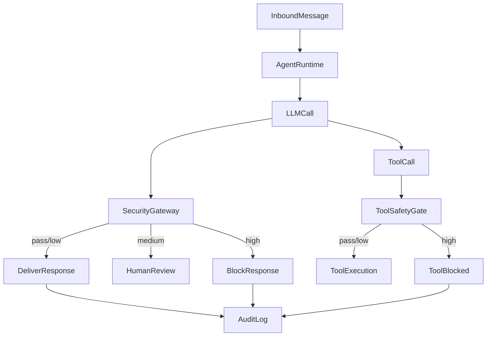

# OpenClaw 安全版开源路线

## 现状与可复用基础

- 已有安全网关入口与配置：`src/security/gateway.ts`、`src/config/types.security.ts`、`src/config/zod-schema.ts`
- 已在输出与工具调用链路接入安全检查：`src/auto-reply/reply/agent-runner.ts`、`src/agents/pi-embedded-subscribe.handlers.tools.ts`
- 日志脱敏与安全审计能力：`src/logging/redact.ts`、`src/security/audit.ts`、`src/security/fix.ts`

## 阶段性路线（产品 + 技术）

### Phase 0: 安全版 MVP（2-4 周）

- 目标：形成“安全版可用”的基线能力，对模型输出和工具调用做统一鉴定与阻断。
- 技术点：
  - 统一安全检查接口与结果格式（复用 `SecurityGateway`）。
  - 对高风险结果**硬阻断**；中风险进入**人工确认**流程（先日志占位）。
  - 对工具调用实现“前置可拦截”路径（在工具定义层或执行器增加 gate）。
- 交付：
  - 开源仓库内置安全网关配置模板与示例。
  - 轻量安全服务（本地/远程）示例实现。

### Phase 1: 爆点体验（4-8 周）

- 目标：让安全版具备“开箱即用 + 可解释 + 可运营”的产品特征。
- 技术点：
  - **风险解释**与**修复建议**返回（安全网关返回 reason/tags -> UI/CLI 展示）。
  - **策略引擎**：规则 + 模型 + 关键字黑白名单（配置化与热更新）。
  - **审计闭环**：所有鉴定记录入库 + 脱敏存档。
- 交付：
  - 安全事件流转（输出 -> 鉴定 -> 拦截/放行 -> 审计）。
  - 默认风险策略包（适用于通用场景）。

### Phase 2: 企业级扩展（8-12 周）

- 目标：形成“安全版企业能力”的上限。
- 技术点：
  - 多租户与策略分级（按 agent / workspace / channel）。
  - PII 检测 + 自动脱敏（与 `redactSensitiveText` 形成联动策略）。
  - 外部审核集成（可接第三方合规模型或自建服务）。
- 交付：
  - 安全策略 SDK + 插件化接口。
  - 安全评测基准与 CI 测试用例。

## 核心系统链路图

## 涉及文件与改动范围（后续实施）

- 安全鉴定与策略：`src/security/gateway.ts`、`src/config/types.security.ts`、`src/config/zod-schema.ts`
- 输出链路拦截：`src/auto-reply/reply/agent-runner.ts`
- 工具调用拦截：`src/agents/pi-embedded-subscribe.handlers.tools.ts` 与工具执行入口
- 审计与脱敏：`src/security/audit.ts`、`src/logging/redact.ts`
- 文档与示例：`docs/` 或新增 `docs/security/` 目录

## 实施里程碑

- M1：安全网关 + 输出鉴定拦截上线
- M2：工具调用拦截 + 审计链路可用
- M3：策略引擎 + 风险解释/修复
- M4：企业级扩展（多租户/PII/第三方合规）
